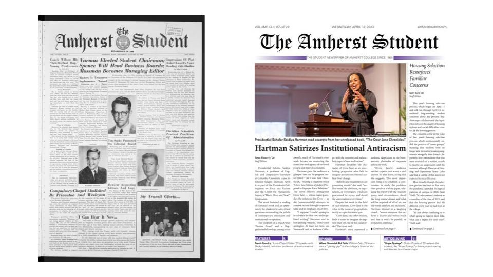

```{r setup, include = FALSE}
# Set code chunk defaults 
# Consider adding `message = FALSE` option
knitr::opts_chunk$set(echo = FALSE) 
                      
# Set R environment options
options(knitr.kable.NA = '')

# Load packages
library(knitr)
library(tidytext)
library(tidyverse)
library(wordcloud)
library(textdata)
library(ggplot2)
library(scales)
library(kableExtra)
```

# Introduction

Amherst students have a wide range of interests, hobbies, and experiences. With a student body of less than 2,000, Amherst prides itself on this diversity. How is this diversity reflected in student writing? And what does this tell us about the priorities and concerns of the student body? To answer these questions, we analyzed all 76 articles published this school year in the Opinion section of [The Student](https://www.amherststudent.com/), the main student-run newspaper at Amherst College. 

The Opinion section spans a large pool of topics, from health, to college policies, to politics. After scraping the text from the Amherst Student Opinion articles webpage and filtering out the illustrations/cartoons, we looked at the breakdown of these articles by subject matter in the headlines, as well as the most common words and phrases referenced in the article bodies. We performed sentiment analysis using both AFINN and NRC lexicons and examined changes in emotion and topics over the past nine months of the school year. 

```{r, fig.cap='Two issues of the Amherst Student from January 1960 (right) and April 2023 (left)', out.width="100%", fig.align="center"}

```


# Categorizing by Topic

Our dataset includes 76 articles from the Student, ranging from September 2022 to April 2023. We categorized each article by topic by looking at key words in each title. For example, the "health" category groups articles together that have the words "illness", "health", "ableism", "cancer", or "pandemic" in their title. The "policy" category groups articles that address some form of Amherst College policy, whether it be the open curriculum, the structure of the AAS, J-term classes, or the new Latin Honors requirements (a particularly popular one this semester), to name a few. We observe that around 15% (11/76) of the articles directly address college policy and 13% (10/76) directly address politics in their headlines. Furthermore, articles about policy and politics are around twice as common as articles about health or finances.

These topics are not mutually exclusive; for example, an article about the college's response to COVID-19 would be grouped under both "policy" and "health". 

```{r ggplot-example, fig.align="left", out.width="100%"}
#reading in dataset
opinions <- read_csv("data/opinions.csv", show_col_types = FALSE)

#making categories for article topics
Title = opinions %>% select("Title")
all_words_in_titles <- Title %>%
  unnest_tokens(output = word, input = Title)

policy <- all_words_in_titles %>% filter(word == "AAS" | word == "requirements" | word == "attendance"| word == "curriculum"| word == "constitution"| word == "j-term"| word == "mask"| word == "class"| word == "covid" | word == "space" | word == "policies" | word == "haven")

finances <- all_words_in_titles %>% filter(word == "aid" | word == "tuition"| word == "pay"| word == "money" | word == "fee" | word == "financial")

health <- all_words_in_titles %>% filter(word == "illness" | word == "health"| word == "ableism" | word == "cancer" | word == "pandemic" | word == "mask" | word == "bruce")

politics <- all_words_in_titles %>% filter(word == "macro-" | word == "tragedy" | word == "columbus" | word == "israel" | word == "insider" | word == "discourse")

sports <- all_words_in_titles %>% filter(word == "bruce" | word == "badminton")

#making table of category frequency
topics <- c("policy", "health", "finances", "politics", "sports")
count <- c(as.numeric(count(policy)), as.numeric(count(health)), as.numeric(count(finances)), as.numeric(count(politics)), as.numeric(count(sports)))
title_topics <- data.frame(topics, count)
kable(title_topics, caption = "Table 1: Breakdown of The Student articles by topic")

#making barplot of category frequency
ggplot(data = title_topics, aes(x= topics, y = count, color = topics, fill = topics)) + 
  geom_col() + 
  labs(
    x = "Topics",
    y = "Number of articles",
    subtitle = "September 2022 to April 2023",
    title = "Figure 1: Categorizing The Student Article Titles by Topic")

```


## Word and Phrase Frequency

What words and phrases are most common in the Opinion articles from The Student? We can plot the frequency of the most common words in the article bodies, after filtering out the stop-words (as, is, the, etc). "Student/s" and "Amherst" come out on top by a wide margin - no surprises there! "Student" is mentioned almost 400 times in just 100 articles. Other commonly appearing words are "time", "campus", and "college". 
```{r}
#finding most common terms in the body section
Body = opinions %>% select("Body")

all_words_in_body <- Body %>%
  unnest_tokens(output = word, input = Body)


body_words <- all_words_in_body %>% 
  filter(word != "student"  & word!= "it’s") %>%
  anti_join(stop_words, by="word")

body_words %>%
  count(word, sort = TRUE) %>% 
  slice(1:10) %>%
  ggplot(aes(x = fct_reorder(word, n), y = n, color = word, fill = word)) +
  geom_col() +
  # Rotate graph
  coord_flip() +
  guides(color = "none", 
         fill = "none") +
  labs(
    x = NULL,
    y = "Number of instances",
    subtitle = "September 2022 to April 2023",
    title = "Figure 2: Most common words in Amherst Student Opinion Articles")
```

```{r, fig.cap= 'Word cloud of the 50 most common words in The Student Opinion articles', out.width="100%", fig.align="center"}
#creating word cloud

opinion_word_freqs <- opinions %>%
  unnest_tokens(output = word, input = Body) %>%
  anti_join(stop_words, by = "word") %>%
  filter(word != "student" & word != "it’s" & word != "i’m" & word != "don’t" & word != "i’ve") %>%
  count(word, sort = TRUE)

#setting seed for reproducibility
set.seed(100)

#choosing color palette
suppressWarnings(my_palette <- brewer.pal(10, "Dark2"))

opinion_word_freqs %>%
  with(wordcloud(words = word,
      freq = n,
      min.freq = 20,
      max.words = 50,
    # Plot the words in a random order
      random.order = TRUE,
    # Specify the range of the size of the words
      scale = c(3, 1.3),
# Specify proportion of words with 90 degree rotation 
      rot.per = 0.15,
# Color words from least to most frequent
      colors = my_palette,
# Change font family
      family = "sans"))
```

We also looked at the most common bigrams, or two-word phrases, in the articles. The three most common bigrams are "Student body", "latin honors", and "mental health". This is in agreement with the table above, which illustrates that college community policies and health lie among the most common article topics that Amherst students feel most compelled to write about. In this past year in particular, changes to the Latin honors breadth requirement and its effect on Amherst's open curriculum were widely written about. Other timely article topics that we saw from our word cloud and the plot below included changes to the Association of Amherst Students (AAS) and the increased budgetary/financial limitations Amherst has experienced over the past semester. Also, related bigrams like "dining hall", "financial aid", and "western Massachusetts" appear to all be topics of relevance to the current Amherst student body.

```{r}
#finding most common bigrams (2-term phrases)
#creating bigram token 
opinions_bigrams <- Body %>%
  unnest_tokens(output = bigram, input = Body, token = "ngrams", n = 2)

opinions_bigrams_clean <- opinions_bigrams %>%
  separate(col="bigram", into=c("word1", "word2"), sep=" ", remove=FALSE) %>%
  anti_join(stop_words, by=c("word1"="word")) %>%
  anti_join(stop_words, by=c("word2"="word")) %>%
  filter(!is.na(bigram)) %>%
  #removing irrelevant/uninformative bigrams
  filter((!grepl("amherst|editorial board|email protected|articles comment|emailing email", bigram))) %>%
  count(bigram, sort = TRUE) %>%
  slice(1:10)

#plotting most common bigrams
ggplot(opinions_bigrams_clean, aes(x = fct_reorder(bigram, n), y = n
                                , color = bigram, fill = bigram)) +
geom_col() +
# Rotate graph 
  coord_flip() + guides(color = "none",
         fill = "none") +
  labs(
x = NULL,
    y = "Number of instances",
    title = "Figure 3: Most common bigrams in Amherst Student Opinion articles")
```

# Categorizing by Sentiment and Emotion

We also analyzed the overall sentiment of these articles, and how this has changed over time. Has student writing in Amherst College's largest publication become more positive or negative over the past 9 months? What kind of words from the articles are classified as having more positive or negative, joyful or sad connotations? What does the overall sentiment of articles published in the Opinion section look like?

## AFINN Lexicon

The AFINN Lexicon assigns each word or term a value, or "sentiment score" from -5 to 5, with 5 being the most positive sentiment and -5 being the most negative sentiment. Table 2 shows that most terms in the articles are classified by the lexicon as neutral to slightly positive. Coincidentally, no words in the articles were classified as purely neutral with a score of 0. 

```{r}
afinn_lexicon <- get_sentiments("afinn")

#creating dataset using afinn lexicon grouped by date
suppressMessages(opinion_afinn <- opinions %>%
  unnest_tokens(word, Body) %>%
  anti_join(get_stopwords(), by = "word") %>%
  inner_join(get_sentiments("afinn")))

#getting word count for each sentiment value (-5 to 5)
opinion_afinn_count <- opinion_afinn %>%
  count(value)

#displaying table
kable(opinion_afinn_count, col.names = c("Value", "Number of Words"), caption = "Table 2: Frequency of words with various AFINN scores")

#displaying barplot
ggplot(opinion_afinn_count, aes(x = value, y = n, fill = value)) +
  geom_col() +
  labs(
    x = "Sentiment",
    y = "Number of words in Student Opinion Articles",
    title = "Figure 4: Sentiment value according to AFINN Lexicon")
```


Below, we grouped the sentiment scores by article. The density plot conveys the probability that an article has a certain sentiment score. The median score of 29 in Table 3 reveals that the average sentiment of the Opinion articles is generally neutral to positive, with a quarter of articles having total sentiment scores of 8.75 or below (slightly positive to negative)and a quarter having scores of 76 or above (positive to very positive). The article with the most negative sentiment of -91 is titled "Under the Rubble: A Tragedy Reveals Cultural Bias" and discusses Amherst's failure to address and provide support for the February 2023 earthquakes in Syria and  Türkiye. The article with the most positive sentiment score of 132 is titled "Val for Pal: How To Maintain Your Long-distance Friendship" and offers advice on cultivating worldwide/long-distance friendships from the perspective of an international student. It seems like some particularly positive articles (sentiment >90) are driving the overall score to lean positive.

```{r}
# making density plot of afinn scores by article
afinn_byarticles <- opinion_afinn %>%
  group_by(Title) %>%
  summarize(article_score = sum(value))
ggplot(data = afinn_byarticles, aes(x = article_score)) +
  geom_density(color="#AF7AC5", fill="#AF7AC5", alpha = 0.5) +
  theme_classic() +
  labs(title = "Figure 5: Distribution of Total Article Sentiment Scores based on AFINN Lexicon", x = "Article Sentiment Score")

# overall favstats by article -- median of 29 is positive
suppressMessages(kable(mosaic::favstats(~article_score, data=afinn_byarticles), caption = "Table 3: Distribution statistics of article scores under the AFINN Lexicon"))
```


The graph below plots article sentiment according to the AFINN lexicon over the duration of the school year by issue date. Over time, there appears to be no drastic change in overall sentiment. Overall sentiment peaked at the end of the fall semester in December, which had total sentiment scores across issues of around 300 with articles like "People Like You More Than You Think" (11/30/23) and "In Praise of the Jones Library" (12/7/23). During the Spring semester, however, the sentiment seemed to be growing more negative with articles like "ChatGPT’s Apocalypse Already Happened" (2/15/23 Issue) and "Strict Attendance Policies Do More Harm Than Good" (3/29/23 Issue). Of course, more significant conclusions would require a much larger dataset.

```{r}
#plotting graph of sentiment in articles over time
opinion_narrative <- opinion_afinn %>%
  group_by(Date) %>%
  summarize(sentiment = sum(value))
  
ggplot(opinion_narrative, aes(x = Date, y = sentiment)) + 
  geom_point() + 
  scale_x_date(breaks = date_breaks("months"), labels = date_format("%B")) +
  geom_smooth(formula = y ~ x, method = "loess") +  
  labs(x = "Issue Date",
       y = "Total Sentiment Score for All Articles in Issue",
       title = "Figure 6: Total Sentiment in The Student Over Time by Issue Release Date (AFINN)", subtitle = ("9/14/2022 - 4/26/2023"))
```

Below, we plotted sentiment according to the AFINN lexicon in all 11 articles classified as addressing Amherst College policies. Overall, the sentiment of the classified words tends to fluctuate a lot even within the article itself. However, it is difficult to make generalizations because only 9% (423/4741) of words in the articles are actually recognized by the AFINN lexicon to classify sentiment (the x-axis only ranges from 0 to 60 words).

```{r, out.width="100%"}
#AFINN sentiment for articles about Amherst policies

policy_words <- opinions %>%
  filter(str_detect(str_to_lower(Title), "policy|policies|financial aid|curriculum|case|fee|requirements|tuition|ableism")) %>%
  unnest_tokens(output=word, input=Body, token="words") %>%
  anti_join(stop_words, by="word") %>%
  inner_join(afinn_lexicon, by="word") %>%
  group_by(Title) %>%
  mutate(seq=row_number())

ggplot(policy_words, aes(x=seq, y=value)) +
  geom_line() +
  geom_hline(yintercept=0, lty="dashed", color="red") +
  facet_wrap(~Title, labeller = labeller(Title = label_wrap_gen(width = 23))) +
  labs(x="Word Sequence", y="AFINN Sentiment", title = "Figure 7: Sentiment in Opinion Articles About Amherst Policies")


```


## NRC Lexicon

The NRC lexicon categorizes words in a binary fashion ("yes"/"no") into categories of positive, negative, anger, anticipation, disgust, fear, joy, sadness, surprise, and trust.

We plot the top 10 words across all articles from the dataset for each of the following sentiments below. Interestingly, frequently-used words like "elite", "majority", and "pay" are classified under "joy" and words like "income," "vote," and "pandemic" are classified under "sadness." 


```{r}
#top words by sentiment
nrc_lexicon <- get_sentiments("nrc")

suppressWarnings(nrc_opinions <- opinion_word_freqs %>%
  inner_join(nrc_lexicon, by = "word") %>%
  filter(sentiment %in% c("positive", "negative", "anger", "disgust"
                          , "joy", "sadness")) %>%
  arrange(sentiment, desc(n)) %>%
  group_by(sentiment) %>%
  slice(1:10))

#plotting top 10 words under each sentiment
ggplot(data=nrc_opinions, aes(x = reorder(word,n), y = n, fill = as.factor(n))) +
  geom_col(show.legend = FALSE) +
  labs(x = NULL, y = "Frequency", title = "Figure 8: Classification of certain words under the NRC lexicon") +
  facet_wrap(~ sentiment, ncol = 2, scales = "free") +
  coord_flip()
```

The tables below display the Top 15 most common words in the Opinion articles classified as both "positive" and "negative" by the NRC lexicon. Frequently-used "negative" words include "noise," "lack," and "crisis", and top "positive" words include "community," "culture," and "learning."

```{r}

suppressMessages(opinions_nrc <- opinions %>%
  unnest_tokens(word, Body) %>%
  #removing most common irrelevant/incorrectly classified words
  filter(word != "liberal" & word != "rail" & word != "anonymous" & word != "pay" & word != "president" & word != "question" & word != "library") %>%
  anti_join(get_stopwords(), by = "word") %>%
  inner_join(get_sentiments("nrc"), multiple = "all"))

#creating dataset with top20 most frequent words classified as negative
nrc_negative <- get_sentiments("nrc") %>% 
  filter(sentiment == "negative")

suppressMessages(opinions_neg <- opinions_nrc %>%
  inner_join(nrc_negative) %>%
  count(word, sort = TRUE) %>%
  slice(1:15))

#creating dataset with top20 most frequent words classified as positive
nrc_positive <- get_sentiments("nrc") %>% 
  filter(sentiment == "positive")

suppressMessages(opinions_pos <- opinions_nrc %>%
  inner_join(nrc_positive) %>%
  count(word, sort = TRUE) %>%
  slice(1:15))
```

```{r}
#table of top 15 "negative" words

kable(opinions_neg, col.names = c("Word", "Frequency"), caption = "Table 4: Top 15 Words in the Student Opinion articles classified as 'negative' in NRC lexicon by frequency") %>%
  kable_styling(font_size = 14) %>%
  row_spec(0,bold=TRUE) 
```

```{r}
#table of top 15 "positive" words

kable(opinions_pos, col.names = c("Word", "Frequency"), caption = "Table 5: Top 15 Words in the Student Opinion articles classified as 'positive' in NRC lexicon by frequency") %>%
  kable_styling(font_size = 14) %>%
  row_spec(0,bold=TRUE) 
```

# Limitations
The largest limitation to our analysis is perhaps the size of our dataset, which is only 76 articles. The articles only span over the past 9 months, or since the start of the 2022-2023 school year. To better examine the breakdown of articles by topic, sentiment, and how sentiment has evolved over time, we would need a much larger database. 

\n 
The other major limitation of our sentiment analysis is the AFINN and NRC lexicons themselves. As mentioned above, over 91% of the words in the policy-related articles were not classified by the AFINN lexicon, and we also found that over 79% of all of the words in the articles (6966/8811) were not classified by the NRC lexicon. All analysis done with unigrams (individual words) also does not account for qualifiers like "not" or "somewhat" used before the words themselves, and some words are classified under a certain positive/negative emotion when they can actually have different connotations based on context (words like elite, important, and culture). In general, the classifcations according to the lexicons appear to lean positive for many terms.

\n

Another limitation of our analysis is that we only focused on articles from the Opinion section of the magazine. The other sections include news, arts and music, sports, and features, meaning these subjects may not appear as frequently in the Opinion section. While articles about sports, for example, were not as common in our analysis, readers should not infer this to mean that sports are not frequently written about by Amherst students. 

\n 

It would be nice to generalize our results to make conclusions about the Amherst population as a whole, however, it is important to note that the Student writers may not be an accurate reflection of the entire student body. For instance, while the most common sentiment score was slightly positive, a different set of writers could write much more positively (or much more negatively). 

\n


# References
<!-- knitr -->
The Amherst Student Opinion Section (2023). <https://amherststudent.com/section/opinion>

Yihui Xie (2023). knitr: A General-Purpose Package for Dynamic Report Generation in R.
  R package version 1.42.
  
Yihui Xie (2015) Dynamic Documents with R and knitr. 2nd edition. Chapman and Hall/CRC.
  ISBN 978-1498716963

Yihui Xie (2014) knitr: A Comprehensive Tool for Reproducible Research in R. In
  Victoria Stodden, Friedrich Leisch and Roger D. Peng, editors, Implementing
  Reproducible Computational Research. Chapman and Hall/CRC. ISBN 978-1466561595
  
<!-- tidytext -->
Silge J, Robinson D (2016). “tidytext: Text Mining and Analysis Using Tidy Data
  Principles in R.” _JOSS_, *1*(3). doi:10.21105/joss.00037
  <https://doi.org/10.21105/joss.00037>, <http://dx.doi.org/10.21105/joss.00037>.
  
<!-- tidyverse -->
Wickham H, Averick M, Bryan J, Chang W, McGowan LD, François R, Grolemund G, Hayes A,
  Henry L, Hester J, Kuhn M, Pedersen TL, Miller E, Bache SM, Müller K, Ooms J, Robinson
  D, Seidel DP, Spinu V, Takahashi K, Vaughan D, Wilke C, Woo K, Yutani H (2019).
  “Welcome to the tidyverse.” _Journal of Open Source Software_, *4*(43), 1686.
  doi:10.21105/joss.01686 <https://doi.org/10.21105/joss.01686>.
  
<!-- wordclouds -->
Fellows I (2018). _wordcloud: Word Clouds_. R package version 2.6,
  <https://CRAN.R-project.org/package=wordcloud>.
  
<!-- textdata -->
Hvitfeldt E (2022). _textdata: Download and Load Various Text Datasets_. R package
  version 0.4.4, <https://CRAN.R-project.org/package=textdata>.
  
<!-- ggplot2 -->
H. Wickham. ggplot2: Elegant Graphics for Data Analysis. Springer-Verlag New York,
  2016.
  
<!-- scales -->
Wickham H, Seidel D (2022). _scales: Scale Functions for Visualization_. R package
  version 1.2.1, <https://CRAN.R-project.org/package=scales>.
  
<!-- kableExtra -->  
Zhu H (2021). _kableExtra: Construct Complex Table with 'kable' and Pipe Syntax_. R
  package version 1.3.4, <https://CRAN.R-project.org/package=kableExtra>.


